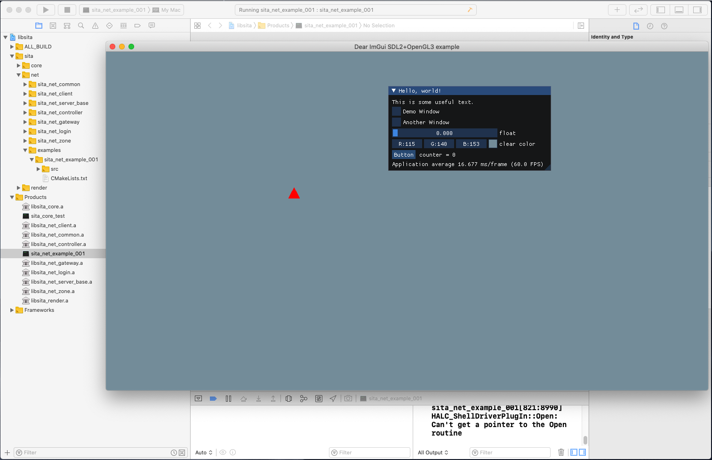
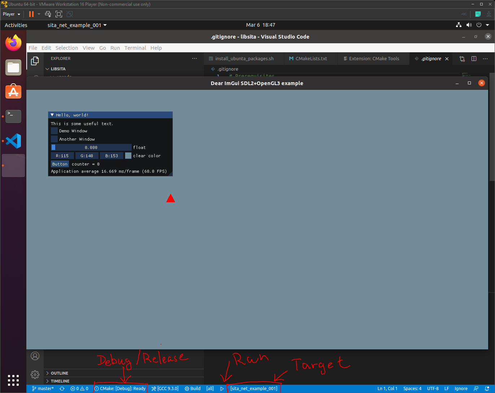

# What is libsita
- Demo source code for C++ tutorial purpose
- The name `libsita` came from [lib]rary [Si]mple [Ta]lk C++
## Modules
- [Core Library - Readme](doc/sita_core/Readme.md)
- [Real-time 3D Renderer Framework - Readme](doc/sita_net/Readme.md)
- [Game Network Framework - Readme](doc/sita_net/Readme.md)


## How to Build 

### build on Windows
```
install_vcpkg_packages.bat
gen_vs2019.bat
```
- Open Visual Studio project in `build/libstia-x64-windows`

]

### build on Mac
```
sh install_vcpkg_packages.sh
sh gen_xcode.sh
```
- Open Xcode project in `build/libstia-xcode`

]

### build on Ubuntu Linux
```
sh install_ubunta_packages.sh
sh install_vcpkg_packages.sh
make
make run
```

### Visual Studio Code + Cmake Tool (Works on Win/Mac/Linux)
- install vscode extension `CMake Tools` and `CMake`
- Build and Run from bottom status bar

