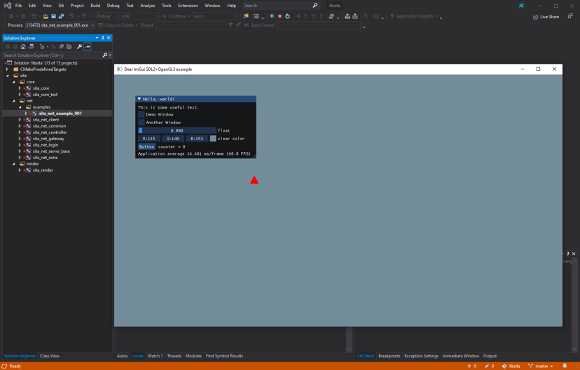
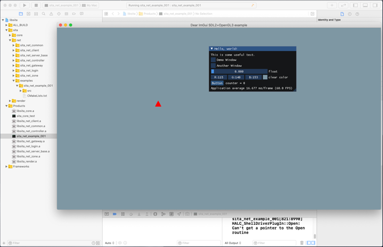
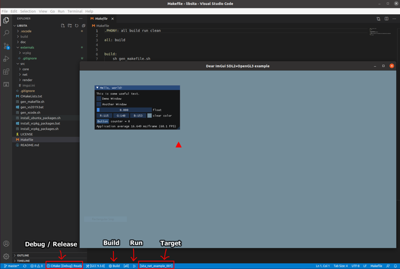

# How to Build 

## Windows
```
install_vcpkg_packages.bat
gen_vs2019.bat
```
- Open Visual Studio project in build/libstia-x64-windows



## Mac
```
sh install_vcpkg_packages.sh
sh gen_xcode.sh
```
- Open Xcode project in build/libstia-xcode



## Ubuntu Linux
```
sh install_ubunta_packages.sh
sh install_vcpkg_packages.sh
make
make run
```

## Visual Studio Code + Cmake Tool
- install extension `CMake Tools` and `CMake`
- Build and Run from bottom status bar

